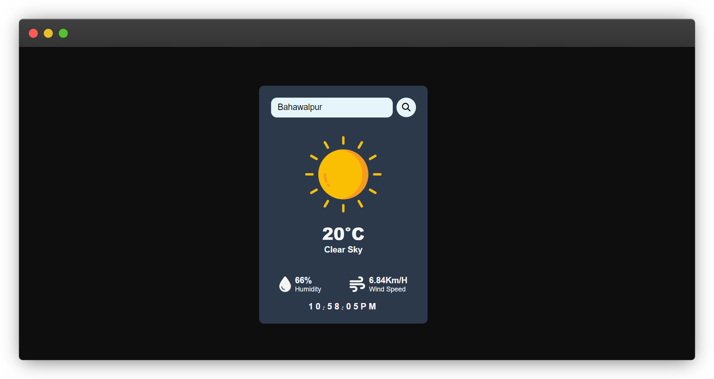
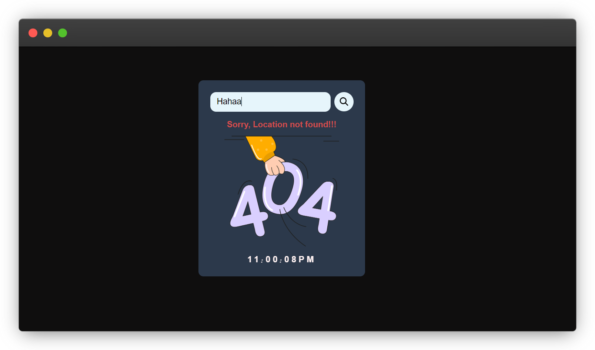

# SkySense Weather App

SkySense is a weather app that provides real-time weather information for any location in the world. It allows users to search for weather information by city name and displays information such as temperature, humidity, wind speed, and weather conditions. The app also features a digital clock that displays the current time.

## Demo

**_[Preview of the Weather App](https://zeeshanmukhtar1.github.io/SkySense-Weather-App/)_**

### Features

- Search for weather information by city name
- Displays temperature, humidity, wind speed, and weather conditions
- Real-time weather data from OpenWeatherMap API
- Digital clock that displays the current time
- Stylish UI design
- Search by pressing the "Enter" key in addition to clicking the search button

### Getting Started

To use the SkySense Weather App, simply open the app and type in the name of the city for which you want to check the weather. The app will display the current weather conditions for that location

### Prerequisites

- Web browser (Google Chrome, Mozilla Firefox, Safari, etc.)

### Installation

Clone the repository:

```
https://github.com/ZeeshanMukhtar1/SkySense-Weather-App.git
```

_Open the index.html file in a web browser._

### Usage

To use the SkySense Weather App, simply type in the name of the city for which you want to check the weather in the input box and press the "Search" button. The app will display the current weather conditions for that location.

### Acknowledgments

- The OpenWeatherMap API for providing real-time weather data.
- The clock code was adapted from [W3Schools](https://www.w3schools.com/js/js_timing.asp).

## 🚀 About Me

Hi, I'm Zeeshan Mukhtar, a front-end developer with a bachelor's degree in IT. I enjoy building user-friendly websites and applications that are both visually appealing and functional. With my skills in HTML, CSS, and JavaScript, I strive to create dynamic and responsive web experiences that engage and delight users.

### 🔗 Connect with me :grin:

[](https://twitter.com/ZeshanMukhtar01)
[](https://twitter.com/ZeshanMukhtar01)
[](https://www.instagram.com/zeshanmukhtar01/)

---

## Screenshots



